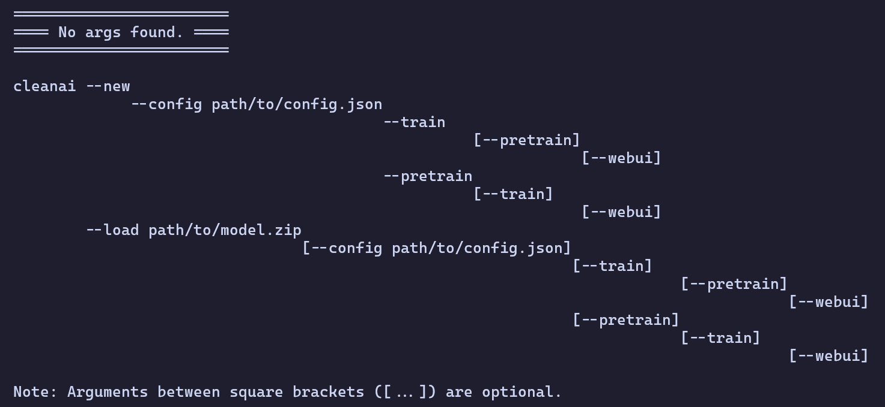

# Guide

## Installation
You can install the cli assuming you've got enough disk space, an internet connection, npm and nodejs installed by running the following command:
```bash
npm install -g cleanai
```

## Update
To update the cli you can run the following command:
```bash
npm update -g cleanai
```

## Uninstall
To uninstall the cli you can run the following command :(
```bash
npm uninstall -g cleanai
```

## How to use the CLI
The cli itself explains this EXTREMELY well, just type:
```bash
cleanai
```
And a polished help messsage will present itself to you, it may look distorted an unreadable if your screen or terminal window is not wide enough tho, that is why I left a screenshot below of how it is supposed to look like:
<br><br>


## Config
The config is a json file as you the help message from the cli suggested, It's structure is slightly different for a new model and a loaded model but the comments should explain that (a config is not required for a loaded model if you're not pre-training or training it further as the help message from the cli suggests).
<br><br>
Example structure for a model:
```jsonc
{
    "pre-training-paths": [ //Only required if you use the --pretrain flag
        "/path/to/pretraining-data.txt",
        "/you/can/have/multiple/as/pre-training/data/is/massive.txt"
    ],
    "training-dataset-path": "/path/to/dataset.json", //Only required if you use the --train flag
    "pre-train-epochs": 1000, //Only required if you use the --pretrain flag
    "train-epochs": 1000, //Only required if you use the --train flag
    "pre-train-optimizer": "adam", //Only required if you use the --pretrain flag
    "train-optimizer": "adam", //Only required if you use the --train flag
    "contextSize": 128,
    "embeddingSize": 128, //Forbidden if you load a model instead of making a new one
    "learningRate": 0.001,
    "maxOutputSize": 16,
    "layersAmount": 4, //Forbidden if you load a model instead of making a new one
    "heads": 4, //Forbidden if you load a model instead of making a new one
    "microbatchSize": 24,
    "biasesinitrange": [-0.01, 0.01], //Forbidden if you load a model instead of making a new one
    "embeddinginitrange": [-0.1, 0.1], //Forbidden if you load a model instead of making a new one
    "antiOverfittingOptimisations": true
}
```
Here's what each parameter is for:
- pre-training-paths: An array of (a) string(s) that are path(s) to txt file(s), they are supposed to be files containing destructured natural language like wikipedia for example.
- training-dataset-path: A string that is the path to the dataset you want to train the model on. It is supposed to be structured natural conversation, how the bot is supposed to respond and converse with the user.
- pre-train-epochs: The amount of epochs you want to pre-train the model for.
- train-epochs: The amount of epochs you want to train the model for.
- pre-train-optimizer: The optimizer you want to use for pre-training, adam is the recommended one.
- train-optimizer: The optimizer you want to use for training, adam is the recommended one.
- contextSize: The size of the context window, the amount of tokens the model can see at once.
- embeddingSize: The amount of learnable values per token in the vocabulary, the higher this is the most data the model can memorize. Increasing this will increase the memory usage and training/inference time. This is forbidden if you load a model instead of making a new one.
- learningRate: The learning rate, the higher this is the more aggressive the model will learn, but the less accurate it will be.
- maxOutputSize: The hard limit for the max amount of tokens the model can output at once.
- layersAmount: The amount of transformer layers in the model, the more layers the deeper the model can be in its reasoning and speech, the lesser the more shallow it will be. Increasing that parameter will increase memory usage and training/inference time. This is forbidden if you load a model instead of making a new one.
- heads: The amount of attention heads in the model, the more the model can understand what you mean exactly and draw relationships between tokens. Increasing that parameter will increase memory usage and training/inference time. This is forbidden if you load a model instead of making a new one.
- microbatchSize: As explained below in "pre-training specifics", this is the size of microbatches aka the amount of tokens my software will be able to accumulate directions of updates to train the ai for before having to average and apply them. Raising this parameter will allow for smoother and a better quality model, it will also make the model more forgiving with higher learning rate the higher it is altough there are diminishing returns on that. This parameter is extremely agressive on memory usage the higher it is, it will hoever make training faster the higher it is as it will delay actually averaging and making the updates to the ai.
- biasesinitrange: The range of the random values that will be used to initialize the biases of the model, I recommend keeping the current one. This is forbidden if you load a model instead of making a new one.
- embeddinginitrange: The range of the random values that will be used to initialize the embeddings of the model, I recommend keeping the current one. This is forbidden if you load a model instead of making a new one.
- antiOverfittingOptimisations: This is a boolean that will enable or disable the anti overfitting optimisations, I recommend keeping it on as it will make the model more general and less likely to overfit.

## Dataset
Dataset should be a json file with the following structure:
```jsonc
[
    { //pair 1
        "inputs": ["input1", "input2", ...],
        "outputs": ["output1", "output2", ...]
    },
    { // you can have as many other pairs as you want
        "inputs": ["Hey there!", "I'm good what about you"],
        "outputs": ["Hey there, how are you?", "I'm good too, have a good day :)"]
    }
]
```
As you can see, you can put multiple conversations called pairs, the dataset is dynamically contextized and trains the ai on the following structure:
<br><br>Pair 1:
```text
user: input1
you: output1<end-of-text>
user: input2
you: output2<end-of-text>
```
Pair 2:
```text
user: Hey there!
you: Hey there, how are you?<end-of-text>
user: I'm good what about you
you: I'm good too, have a good day :)<end-of-text>
```
And so on till the ai is out of pairs which complete's an epoch.
<br>
As you can see there is a special token here (```<end-of-text>```), you don't need to put it in your dataset, it might actually even make the system crash, it is auto added after every ai output in the training dataset. The ai needs to learn to predict it or else it will never ever stop its own generate loop till it hits it's max output size which is obviously not a desired behaviour. 

## Pre-training specifics
Pre-training is used to train the ai to predict language on massive text files. For example try downloading wikipedia, extracting only the plain text that consists of language and splitting it all in 100mb text files. Then you can specify the path of those files in the pre-training-paths array in the config then start the pre-training process. The pre-training process will work as follows:
<br><br>
Picture this, all the text of the first file is in a straight line separated in tokens and there's a rectangle the horizontal size of 1 token on the first token. My software will estimate the direction of the change required so the ai can predict the token on the right edge of the rectangle with it's current context (the tokens inside the rectengle, for now only one) and accumulate it. then we will grow the rectangle one token to the right and repeat this process till either we reach the microbatch size or the context window size, if its the microbatch size, we will average all the directions of the estimated changes and go in that direction by the magnitude of the learning rate, if its the context size then we will make the rectangle slide one token to the right as it cannot extend anymore because its max size is the context size as it is the context window. we will repeat this process which is to slide till the end of the file and average + apply changes every microbatch size till the right edge of the rectangle hits the end of the file. Then we will go and do the exact same process on the next file if there is one. Once we did this with all files we finished a single epoch of the pre-training. <strong>This is called a sliding context window.</strong> 

## Training specifics
The training process will do exactly what is described for the pre-training (sliding context window) except it will slide on each pair in the user:/you: structure instead of files.

## What are epochs
Basically we push the ai in the direction so it can predict the tokens in the dataset/pre-training files by the magnitude of the learning rate. once we did that on all the tokens available we completed one epoch, one iteration. The more epochs there are, the longer training will be but the more accurate the ai will be according to your dataset. This also makes the chances of overfitting higher, and eventually you will hit diminishing returns till the loss plataus.

## What is loss
Loss in this context is a number that defines how accurate the ai is at predicting the outputs of the dataset with the inputs as context or how accurate it is at predicting tokens of the pre-training files with previous tokens of those as context. The lower the loss the higher the accuracy.

## What is overfitting
Overfitting is learning the dataset/pre-training data too well. You might be wondering how this is bad, but this is bad because the ai needs to learn to generalize to not become a simple statistical machine that matches how likely an output from the dataset is to correspond to a given input but actually generate creative outputs that are context accurate and personalized.

## What is a token
In a string there are often multiple tokens they can be words, subwords or things like that, for example:
```text
Hello, World!
```
Could tokenize as:
```text
[Hello,] [ World] [!]
```
Depending on the tokenizer and the vocabulary chosen.

## What is a vocabulary
The vocabulary of a model is simply the list of tokens it can understand and process. There is nothing more to it.

## What is a context window
The context window is the amount of tokens the model can see at once and use to create its response.

## What is inference
Inference is the process of making the model use one or multiple tokens as context to generate a new token, we use this in order to generate responses by creating a loop which keeps calling inference with the input as context and adding the response token to the context till we generate an ```<end-of-text>``` token or we reach the max output size. The model will also use inference to predict the next token in the pre-training and training process.

## Interactive mode
Interactive mode will trigger every time a new epoch is completed and will expire after a 30 seconds timeout if you don't respond to the "Are you there" prompt. It will also trigger after training and pretraining. In any interractive mode console you can type "/help" and press enter for a list of commands. Default temperature when testing the model will be 0.7 making it lower will make the model more deterministic and predictible, while making it higher will make it more random. 0.7 is a good balence.

## Final console
After all the epochs have been completed or you /stop the training while in interactive mode, you will land in the final console which is basically interactive mode without the in-training features. There you can execute /help for a list of commands as usual.

## Are you still lost perhaps? Looking for a practical example?
Well search no more, here: <a href="./example.md">example</a>.

## What each file does
- cleanai.js: Code of the ai.
- package.json: Info for npm.
- quickstart.md: What you're reading rn.
- README.md: Main readme, what you land on when you go on the repo on github.
- vocabulary.json: Tiktoken gpt4 vocabulary but cleaned of tokens I didn't like.
- LICENSE: MIT license.
- deprecated directory: Refer to <a href="./deprecated/deprecated.md">deprecated readme</a>